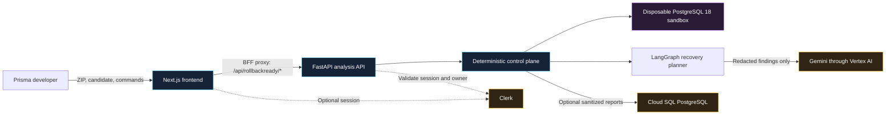
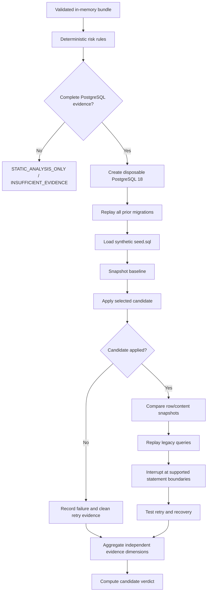
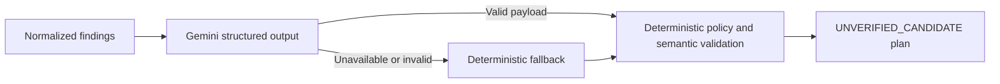
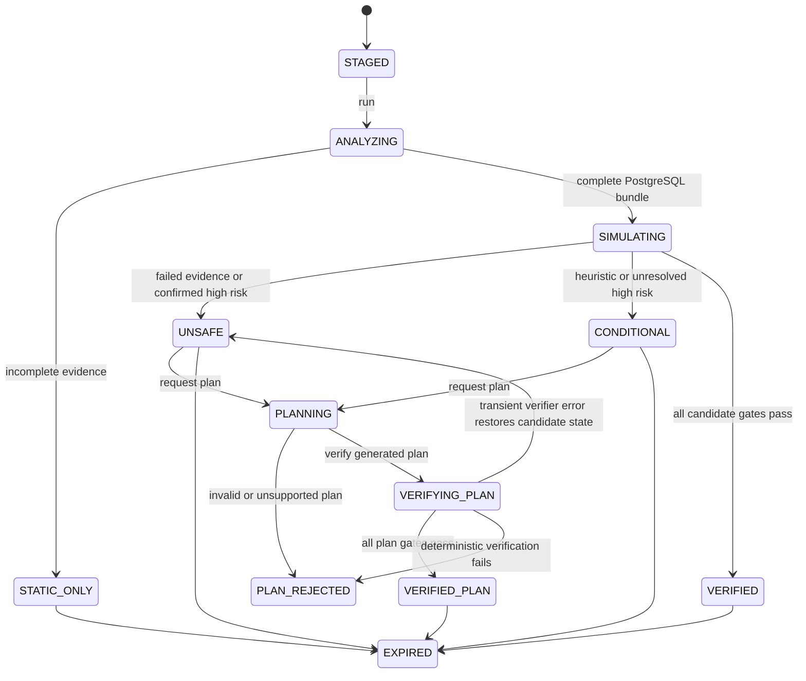
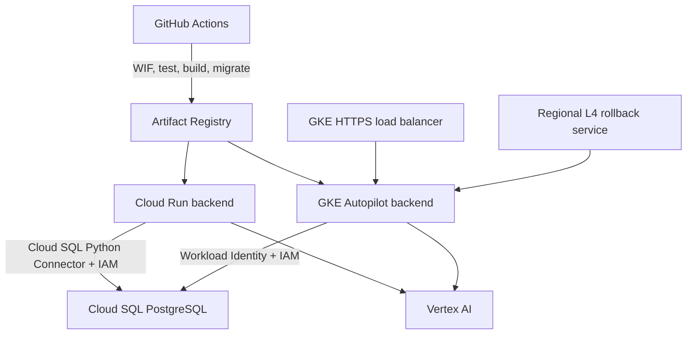

# RollbackReady backend architecture

## 1. Purpose

RollbackReady evaluates Prisma PostgreSQL migrations against synthetic,
production-shaped evidence. It combines deterministic SQL analysis, disposable
database execution, legacy-query replay, interruption experiments, and verified
recovery plans.

The architecture optimizes for four properties:

1. **Evidence over prediction.** Execution results and deterministic policies
   produce findings and verdicts.
2. **Isolation over convenience.** Analysis never connects to production and
   every executable workflow starts from a disposable PostgreSQL baseline.
3. **Explainability over a single score.** Evidence dimensions remain independently
   `PASS`, `FAIL`, or `NOT_TESTED`.
4. **Human authority.** The strongest result is `VERIFIED_FOR_REVIEW`, not an
   instruction to deploy.

## 2. System context



The frontend is a backend-for-frontend client, not a direct database client. The
FastAPI service owns validation, authorization, orchestration, verdicts, and data
retention. PostgreSQL simulation and hosted report persistence are separate
databases with separate credentials and purposes.

## 3. Component responsibilities

| Component | Responsibility | Does not do |
| --- | --- | --- |
| Next.js frontend | Upload, progress, evidence, plan, verification, report download | Risk classification or direct backend-origin uploads |
| API proxy | Attach optional Clerk token and forward request/response semantics | Persist artifacts or make verdicts |
| FastAPI routers | HTTP contracts, multipart intake, rate limiting, owner dependency | Domain decisions |
| `AnalysisService` | Lifecycle, state transitions, orchestration, expiry, persistence boundary | Execute raw SQL directly |
| Intake validator | ZIP safety, artifact discovery, provider/history validation, hashing | Connect to a database |
| SQL policy | Split, classify, redact, count, and block SQL shapes | Claim semantic safety |
| Risk analyzer | Four deterministic rule families and execution confirmation | Use Gemini to score risk |
| `SimulationEngine` | Baselines, fixtures, snapshots, legacy replay, failure injection, plan verification | Use production data |
| `PostgresSandbox` | Native or Docker PostgreSQL 18 lifecycle and resource limits | Accept production credentials |
| `RecoveryPlanner` | Gemini/fallback plan generation and semantic/policy validation | Assign the candidate verdict |
| Evidence repository | Optional sanitized report persistence and owner filtering | Store raw bundles or fixture rows |

## 4. Request and analysis lifecycle

### 4.1 Stage

`POST /api/v1/analyses` accepts either the built-in demonstration or a multipart
ZIP plus explicit candidate folder. Intake performs all archive and SQL-policy
checks before the service creates an opaque analysis ID.

The service stores raw decoded artifacts only in the current process. The
persistable manifest contains artifact paths, byte counts, and SHA-256 hashes.

### 4.2 Analyze and simulate

`POST /api/v1/analyses/{id}/run` follows this pipeline:



The normal candidate run and each supported interruption run preserve statement
indexes, redacted statement shapes, timings, affected-row counts, snapshots,
sanitized errors, retry outcome, and recovery classification.

### 4.3 Generate a recovery plan

`POST /api/v1/analyses/{id}/plans` requires at least one finding. The LangGraph
workflow is:



Gemini is configured with low temperature, a fixed seed, a short timeout, and a
Pydantic-derived JSON schema. Provider failures fail into a narrowly supported
deterministic template; they never bypass policy validation.

### 4.4 Verify a recovery plan

`POST /api/v1/analyses/{id}/plans/{plan_id}/verify` reparses every plan statement
and requires read-only `SELECT` assertions. It then creates a fresh sandbox,
replays the prior history and fixtures, executes every plan phase, evaluates plan
assertions, replays legacy queries, and repeats interruption/retry experiments for
the plan.

All seven mandatory dimensions must pass before the plan can receive
`VERIFIED_FOR_REVIEW`. The original candidate verdict is never overwritten. After
a completed verification, raw bundle data is deleted and only sanitized lifecycle
data remains.

## 5. State model



The diagram abbreviates one detail: a transient plan-verifier error restores the
status corresponding to the stored candidate verdict, so it may return to
`UNSAFE`, `CONDITIONAL`, or `VERIFIED`. The plan returns to
`UNVERIFIED_CANDIDATE` and remains retryable while raw inputs exist.

## 6. Evidence and verdict model

Evidence dimensions:

| Key | Question |
| --- | --- |
| `prior_migrations` | Can the complete prior history rebuild a clean database? |
| `fixture_load` | Can synthetic production-shaped rows be staged? |
| `schema_application` | Does the candidate or plan apply? |
| `data_preservation` | Are baseline row counts and baseline-column values preserved? |
| `legacy_queries` | Do old application query shapes match expected outcomes? |
| `failure_recovery` | Can interrupted execution recover to the intended schema? |
| `idempotent_retry` | Is retry successful or already at the intended state? |

The service computes the candidate verdict deterministically:

- any failed evidence dimension, critical finding, or confirmed high finding:
  `UNSAFE`;
- any untested dimension: `INSUFFICIENT_EVIDENCE`;
- unresolved high risk or heuristic evidence: `CONDITIONALLY_VERIFIED`;
- otherwise: `VERIFIED_FOR_REVIEW`.

Lock risk remains a heuristic because a synthetic sandbox does not reproduce
production traffic, table size, topology, or lock contention.

## 7. Sandbox design

### Native runtime

The production image packages PostgreSQL 18. Each analysis creates a temporary
cluster, starts PostgreSQL without a TCP listener, and connects over a private Unix
socket. The migration role is `NOSUPERUSER`, `NOCREATEDB`, `NOCREATEROLE`, and
`NOINHERIT`.

### Docker development runtime

Local Docker uses `postgres:18-alpine` with:

- `--network none`;
- one CPU, 1 GiB memory/swap, and 128 PID limits;
- `no-new-privileges`;
- a 768 MiB `noexec,nosuid` temporary PostgreSQL filesystem; and
- automatic container deletion.

### Database execution controls

Both runtimes apply statement and lock timeouts, low connection and memory
settings, a temporary-file limit, and a total sandbox deadline. Only one sandbox
runs per backend process. Every restore creates a new database owned by the
restricted migration role.

The SQL policy blocks server/role/database administration, grants and revokes,
extensions, event triggers, procedural functions, external file/network access,
replication, session-role changes, `pg_sleep`, and related escape surfaces.

## 8. Trust and data boundaries

| Data | Location | Retention |
| --- | --- | --- |
| Original ZIP bytes | Request memory during validation | Request scope |
| Decoded schema, migrations, fixtures, legacy queries | `AnalysisService` process memory | Verification, delete, 24-hour expiry, or process exit |
| Synthetic rows | Disposable sandbox only | Sandbox lifetime |
| Gemini input | Outbound request contains normalized findings and redacted SQL shapes only | Governed by the configured Vertex AI service controls |
| Manifest and hashes | In memory; optionally Cloud SQL | Up to analysis expiry |
| Findings, evidence, plans, timeline | In memory; optionally Cloud SQL | Up to analysis expiry |
| Production data and credentials | Nowhere | Never accepted or used |

The report repository is disabled by default. When enabled, it atomically replaces
the sanitized analysis aggregate and owner-filters every read and delete. Database
tables store query hashes and redacted statement evidence, not legacy-query text or
fixture values.

## 9. Authentication and authorization

Anonymous mode returns the reserved owner `__anonymous__`; possession of a UUID is
the hackathon access boundary. When Clerk is configured, the API validates bearer
sessions and authorized parties. When Clerk is required, unauthenticated requests
fail before reaching `AnalysisService`.

Every analysis operation includes the resolved owner ID. A lookup with the wrong
owner returns the same not-found behavior as a missing record to avoid exposing
resource existence.

The create endpoint also applies a per-owner-and-client sliding-window rate limit.
The service limits how many raw bundles may be active in one process.

## 10. Persistence

`ROLLBACKREADY_PERSIST_REPORTS=false` selects a null repository and keeps reports
in memory. Enabling persistence selects the SQLAlchemy repository backed by the
`app` PostgreSQL schema. Alembic revisions create:

- users and optional Clerk ownership;
- analysis metadata and artifact manifests;
- findings and evidence;
- simulation and statement executions;
- legacy-query result hashes;
- timeline events; and
- recovery plans and verification results.

The expiry task runs once per minute. It clears expired raw inputs, removes in-memory
records, and deletes persisted aggregates whose `expires_at` has passed.

## 11. Deployment architecture



One immutable Python 3.13 image is deployed to both Cloud Run and GKE. The image
contains PostgreSQL 18 binaries for native sandbox execution and runs as a
non-root user. Cloud SQL uses IAM database authentication; GitHub and Kubernetes
store no long-lived Google service-account key.

The GKE public API terminates managed TLS at the external load balancer. Pods serve
plain HTTP inside the cluster and expose database-backed readiness. A separate
regional L4 service remains available as a rollback path.

## 12. Scaling and failure behavior

The current design is intentionally synchronous. Raw inputs are process-local,
and a request owns a disposable sandbox until its stage completes. This supports a
fast, auditable hackathon path but creates these constraints:

- an instance restart loses staged raw inputs;
- horizontal routing cannot safely move a lifecycle between instances;
- only one simulation can execute per process; and
- long-running work consumes an HTTP request slot.

The production roadmap moves sandbox execution to isolated asynchronous workers,
stores encrypted temporary artifacts with explicit lifecycle controls, and keeps
the API as a stateless owner-aware control plane. That change enables durable job
queues, retries, autoscaling, and per-job resource isolation without changing the
external evidence contracts.

## 13. Source map

```text
app/core/config.py                    runtime configuration
app/core/clerk_auth.py                anonymous/Clerk identity boundary
app/core/database.py                  local or Cloud SQL engine
app/models/rollbackready.py           sanitized persistence schema
app/rollbackready/contracts.py        API and domain contracts
app/rollbackready/intake.py           bundle validation and demo fixture
app/rollbackready/sql.py              SQL splitting, redaction, and policy
app/rollbackready/risk.py             deterministic risk families
app/rollbackready/sandbox.py          native/Docker PostgreSQL lifecycle
app/rollbackready/simulation.py       evidence and failure injection
app/rollbackready/planning.py         LangGraph, Gemini, fallback, validation
app/rollbackready/persistence.py      null/SQLAlchemy evidence repositories
app/rollbackready/service.py          lifecycle orchestration and verdicts
app/routers/analyses.py               authenticated analysis endpoints
app/main.py                           FastAPI assembly and expiry lifecycle
alembic/versions/                     persistent schema history
k8s/                                  GKE runtime and ingress configuration
```

## 14. Architectural decisions

- **Complete migration history is input.** `schema.prisma` alone cannot reconstruct
  the state that Prisma will deploy.
- **The selected candidate must be last.** This removes ambiguous ordering from the
  synchronous comparison model.
- **Static-only is a valid result.** Missing evidence reduces the claim instead of
  fabricating a pass.
- **AI is downstream of risk detection.** Deterministic logic owns findings and
  verdicts; AI proposes recovery only.
- **Plan verification is a separate verdict.** A safer plan cannot erase evidence
  that the submitted candidate was unsafe.
- **Raw data is intentionally non-durable.** This minimizes exposure in the MVP and
  makes the scaling limitation explicit.
- **Persistence is replace-by-aggregate.** A complete sanitized report is written
  atomically, keeping API state and stored evidence synchronized.

## 15. Related documents

- [Backend README](README.md)
- [Full product requirements](docs/rollbackready-prd.md)
- [Rendered product requirements](docs/RollbackReady-PRD.docx)
- [Frontend README](../frontend/README.md)
